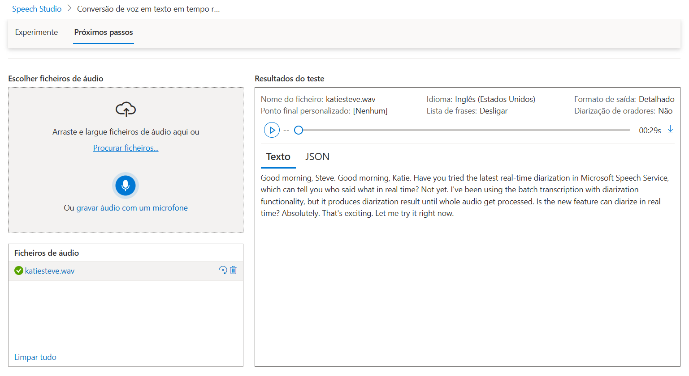
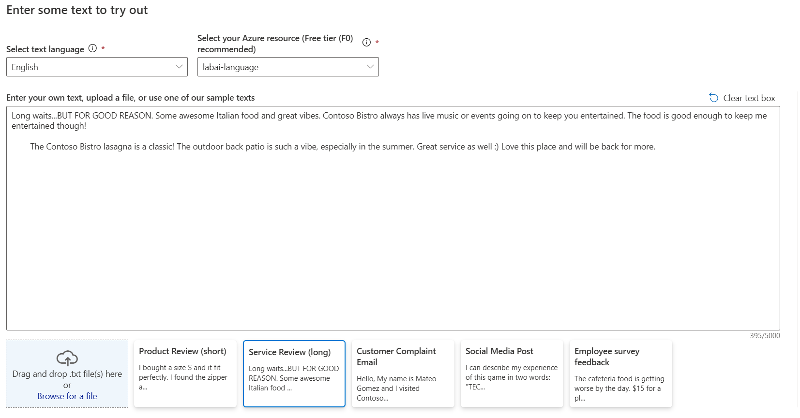
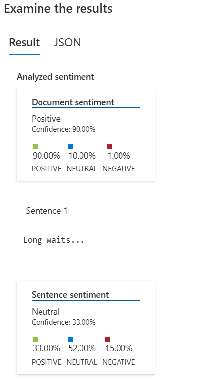
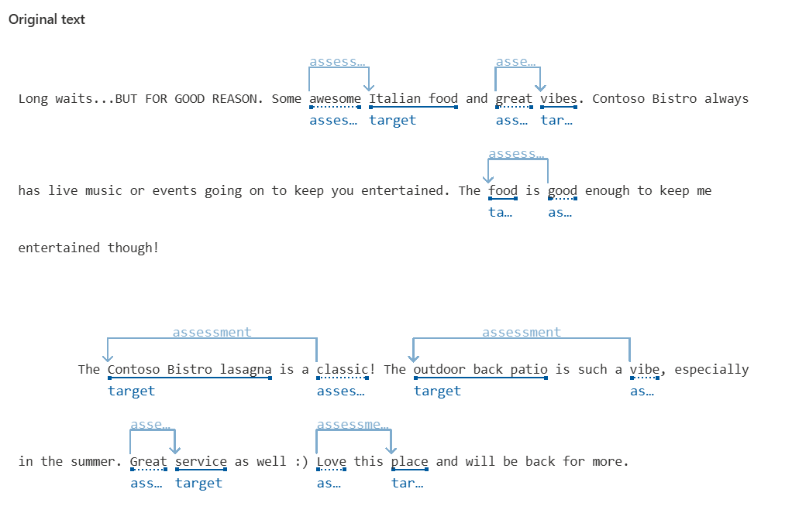

# Projeto Azure Speech Studio e Language Studio

## Objetivo

Este projeto tem como objetivo a análise de voz e texto utilizando o [Speech Studio](https://speech.microsoft.com) e o [Language Studio](https://language.cognitive.azure.com).

## Desafio Speech Studio

- Pesquisar por um ficheiro que será transcrito pelo Speech Studio, p.ex. no GitHub da [Azure Samples](https://github.com/Azure-Samples/cognitive-services-speech-sdk/tree/master/sampledata).
- Na secção **Conversão de voz em texto**, clicar em **Conversão de voz em texto em tempo real**
- Processar ficheiro escolhido das samples da Azure
- Documentar resultado na pasta `images/`.

## Desafio Language Studio

- Aceder ao [Portal da Azure](https://portal.azure.com) e clicar em **Create a resource**
- Procurar por **Language Service** e criar o recurso
- Após o recurso criado, aceder ao portal do [Language Studio](https://language.cognitive.azure.com)
- Clicar em **Classify text** e depois em **Analyze sentiment and opinions**
- Utilizar um dos exemplos do Azure
- Documentar resultado na pasta `images/`.

## Resultados

- Speech:
  
- Language:
  
  
  
